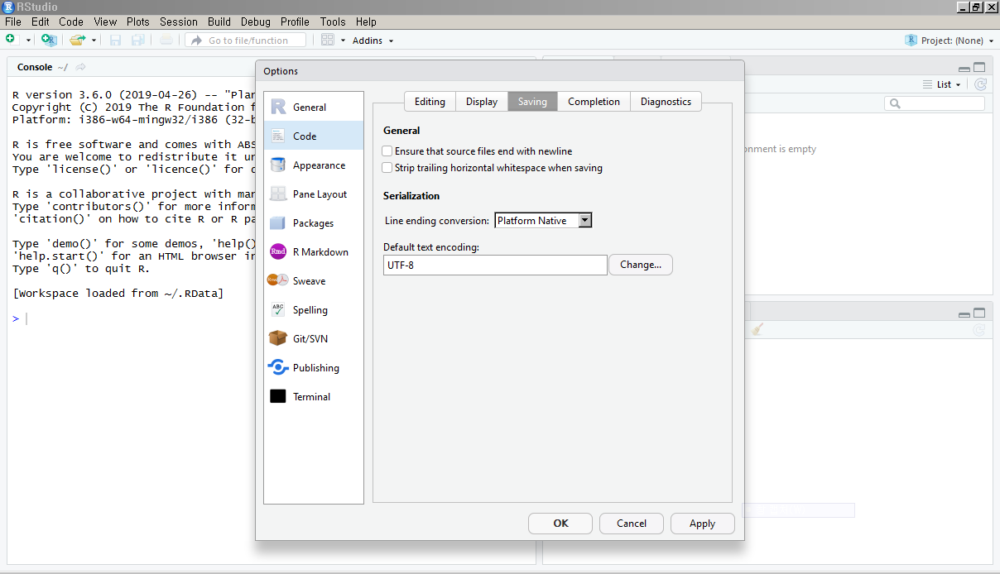
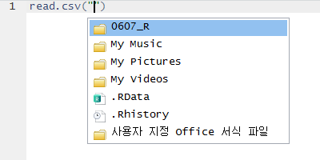

# R 기본기

Updated : 2019. 06. 06.

---

## RStudio에서 R 시작하기

Windows 환경에서 R 버젼은 `3.6.0`, RStudio 버젼은 `1.1.463` 으로 잘 작동함을 확인했습니다. 

### 화면 구성


- Script 창에 코드입력
- Script 창에서 코드 실행 (Ctrl + Enter)
- Console 창에서 명령어 실행
- Environment 창에서 변수 확인
- Etc. 창에서 파일 및 폴더, Ploting 이미지 등 확인

### 설정

`Tools` -> `Global Options`

- 코드 디스플레이 : `Code` -> `Display`


- 코드 인코딩 : `Code` -> `Saving`



- 폰트 및 테마 : `Appearance`


### 자동완성

3글자 이상 입력하면 자동완성 메뉴가 나타납니다. 화살표로 선택하여 `TAB`키로 명령어를 완성합니다.




### 섹션 분할


### 명령어 입력 및 실행


- Script 창에 코드를 입력하고 `Ctrl + Enter` 또는 `Run` 단추 클릭


### 데이터프레임

#### 여러가지 기본 자료형


출처 : https://steemit.com/kr/@hironlee/r-db

자료형 확인 함수 : `class()`

- 벡터(Vector) : `c()`
- 행렬(Matrix) : `matrix()`
- 어레이(Array) : `array()`
- 데이터프레임(Data Frame) : `data.frame()`
- 리스트(List) : `list()`
- 기타 등등..

본 내용에서는 **벡터**와 **데이터프레임**에 대해서만 다루도록 하겠습니다. 


---

#### 벡터

- 벡터 생성

``` r
V1 <- c(1, 2, 3)
V2 <- 1:3
V3 <- c("A", "B","C","D")
V4 <- c(1.1, 2.2, 3.3)
V5 <- c(TRUE, FALSE, TRUE, FALSE)
V6 <- c(1, 2, "A", "B")
```

`V6`의 성분에 1과 2가 문자로 들어있는 것을 확인합니다.

- 벡터 성분 불러오기

``` r
V1[3]
V3[3:4]
V5[3]
```

- 벡터 성분 바꾸기

``` r
V1[3] <- 10
V3[3:4] <- c("CC","DD")
V5[3] <- 1
```

`V5`의 모든 성분이 숫자로 바뀐 것을 확인합니다. 

> Q. 1부터 10까지 자연수를 문자성분으로 갖는 벡터 W를 생성하세요. 

---

#### 데이터프레임

- 데이터프레임 생성

``` r
data.frame(V2, V3)   # 에러
D1 <- data.frame(V1, V2)
D2 <- data.frame(V3, V5, V6)
```

- 데이터프레임 크기

``` r
dim(D1)
dim(D2)

nrow(D1)
nrow(D2)

ncol(D1)
ncol(D2)
```

- 데이터프레임 행 및 열 이름

``` r
rownames(D1)
rownames(D2)

colnames(D1)
colnames(D2)
```

- 데이터프레임 행 불러오기

``` r
D1[ , ]
D1[c(1), ]
D1[c("1"), ]
D1[c(2, 3), ]

```

- 데이터프레임 열 불러오기

``` r
D2[ , ]
D2[ , c(V3)]   # 에러
D2[ , c("V3")]
D2[ , c("V3", "V5")]
D2[ , 2:3]
D2[ , 2:4]   # 에러

D2$V3
```

- 데이터프레임 열 이름 하나 변경

``` r
colnames(D1)[colnames(D1) == "V1"] <- "new1"
colnames(D1)[2] <- "new2"
```

- 데이터프레임 열 이름 여러개 변경

``` r
colnames(D2) <- c("new1", "new2")          # 세번째 열이 비어있는 것을 확인
colnames(D2) <- c("new1", "new2", "new3")
```

- 데이터프레임 열 추가 및 추출

``` r
D2$add <- c(1,2,3)            # 에러
D2$add <- c(1, 2, 3, 4)       # add 열(네번째 열)을 추가
D2$add <- c(10, 20, 30, 40)   # 열 성분 수정
D2[ , 1:3]                    # 첫번째 열부터 세번째 열까지
D2[ , -c(4)]                  # 네번째 열 이외의 열
D2[ , -c("add")]              # 에러
```

행 갯수에 대해서 알맞은 열을 추가해야합니다.
열 이름을 제외한 열을 추출할 수는 없습니다. 

> Q. 다음과 같은 형태의 데이터프레임을 만들어봅시다.

| rownames \ colnames | col1 | col2 | col3 |
|--------------------:|-----:|-----:|-----:|
|                row1 |    1 |  "9" |    5 |
|                row2 |    2 | "10" |    6 |
|                row3 |    3 | "11" |    7 |
|                row4 |    4 | "12" |    8 |


#### 데이터프레임 병합

- `rbind()`

두 데이터프레임을 아래위로 합칩니다.

``` r
years_1 <- c("2016", "2017", "2018", "2019")
ani_1 <- c("원숭이", "닭", "개", "돼지")

# Chinese Zodiac : 생초 
cz_1 <- data.frame(years_1, ani_1)

cz_2 <- data.frame(years_2 = c("2020", "2021", "2022"),
			       ani_2 = c("쥐", "소", "호랑이"))

rbind(cz_1, cz_2)   # 에러

colnames(cz_1) <- c("years", "animal")
colnames(cz_2) <- c("years", "animal")

rbind(cz_1, cz_2) 
```

아래위로 합치기 위해서는 **열 이름**이 같아야 합니다.

- `cbind()`

두 데이터 프레임을 좌우로 합칩니다.

``` r
cbind(cz_1, cz_2)   # 에러

cz_2 <- rbind(cz_2,
              data.frame(years = c("2023"),
			             animal = c("용"))

cbind(cz_1 ,cz_2)
```

좌우로 합치기 위해서는 **행 갯수**가 같아야 합니다.

> Q. 다음 두 데이터프레임을 cbind로 합치면 어떤 결과가 나올까요?

``` r
Robot <- data.frame(name=c("RoboCop", "Terminator"))
rownames(Robot) <- c("1987", "1984")

Gun <- data.frame(model=c("오토나인", "레버액션 샷건"))
rownames(Gun) <- c("20발", "12발")

cbind(Robot, Gun)

cbind(Gun,   Robot)
```

행 이름을 확인합니다.

- `merge()`

데이터프레임의 merge에는 다음 4가지 방법이 있습니다. 


다음 데이터프레임 2개를 준비합니다.

``` r
C1 <- data.frame(cust_id = c(1:6), 
        buy = c("자동차", "배", "고양이", "기차", "아파트", "땅")
C2 <- data.frame(cust_id = c(4:8),
        age = c("92", "85", "110", "26", "43", "35")
```


1. merge() : Inner Join

	``` r
	merge(x = C1, y = C2, by = "cust_id")
	```

2. merge() : Outer Join

	``` r
	merge(x = C1, y = C2, by = "cust_id", all = TRUE)
	```

3. merge() : Left Outer Join

	``` r
	merge(x = C1, y = C2, by = "cust_id", all.x = TRUE)
	```

4. merge() : Right Outer Join

	``` r
	merge(x = C1, y = C2, by = "cust_id", all.y = TRUE)
	```


