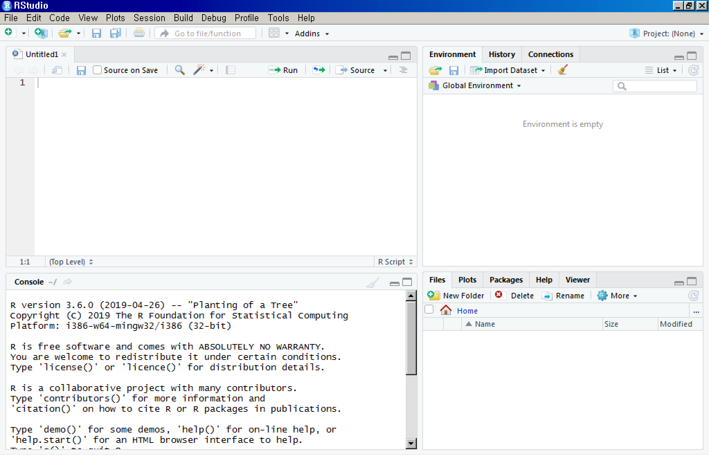

# R 실습 및 소개

Updated : 2019. 05. 26.

---

## RStudio 시작하기

---
### **준비**

Windows 환경에서 R 버젼은 `3.6.0`, RStudio 버젼은 `1.1.463` 으로 잘 작동함을 확인했습니다. 아래 링크로 자료를 다운로드 한 뒤에 다음 단계를 따라합니다.

- 다운로드 링크 : (약 00mb)

<https://drive.google.com/open?id=1phtmhPpK4VuBeDkITGwgIrCyzLPFNx7y>

  1. 압축을 풀편 `0607_R` 폴더가 만들어집니다.
  2. `RoboCop.R` 파일을 실행.

### 화면 구성



- Script 창에 코드입력
- Script 창에서 코드 실행 (Ctrl + Enter)
- Console 창에서 명령어 실행
- Environment 창에서 변수 확인
- Etc. 창에서 파일 및 폴더, Ploting 이미지 등 확인


스크립트 창에 다음 코드를 실행해 봅니다. 
```r
# CODE-1

install.packages("tidyverse")

library(tidyverse)
```

Tidyverse는 데이터 분석에 편리한 6개의 중요 패키지를 모은 패키지 입니다.
- 홈페이지 URL : <https://www.tidyverse.org/>


---

## 대뜸 따라하기

**문제 : 우리동네 치킨집은 몇 개일까?**

### 문제 해석

- 우리동네 : 금정구의 동단위 정보로 제한
- `치킨집` : 등록된 "업태구분명"에 "통닭"이 들어가는 모든 가게
- **목표** : 금정구의 동별 `치킨집` 갯수 계산

### 문제 해결 순서

1. 데이터 얻기
    - 어디서 어떤 자료를 모아야 할까?
2. 자료 전처리 및 통계량 계산
    - 동별 업태구분에 따른 가게 정보만 가져올 수 있을까?
    - 데이터의 형태를 어떻게 정리할까?
    - 자료 정리를 위한 방법은?
    - 갯수를 세는 기준과 방법은?
3. 시각화
    - 어떻게 표현하는게 가장 통계량 결과를 잘 볼 수 있을까?

---

#### 1. 데이터 얻기

- 지방행정 인허가 데이터개방 사이트 LOCALDATA
  * URL : <http://www.localdata.kr>


- 부산광역시 데이터 다운로드 (압축된 191개 파일, 약 100mb 용량)
  * `6260000_부산광역시_07_24_04_P_일반음식점.xlsx` 하나의 파일만 사용
    (쉽게 사용하기 위해서 `data.xlsx`로 이름을 변경해서 사용하겠습니다.)


---

#### 2. 데이터 전처리 및 통계량 계산

<!--
##### * 작업 디렉토리 변경

RStudio의 작업 디렉토리(working directory)를 `0607_R` 로 설정합니다.
기본 작업 디렉토리는 `내 문서`로 되어 있습니다. 다음 명령어를 입력합니다.

```r
setwd("0607_R")
getwd()
```
-->

##### * 파일을 불러들여 `stores` 변수에 저장한다.

```r
# CODE-2

library(readxl)

stores <- read_excel("data.xlsx")

head(stores)
```

##### * `stores` 변수의 여러가지 정보를 확인한다.

`stores` 는 일종의 행렬로써 행과 열의 정보를 갖는다. 각 행은 행 번호가 있고, 각 열은 열 이름(colname)이 있다. 우리는 각 열 정보를 확인하고, 필요한 열를 모은다.

```r
# CODE-3

colnames(stores)

head(stores$소재지전체주소)

head(stores$업태구분명)

unique(stores$업태구분명)

head(stores$사업장명)
```

##### * "소재지전체주소"와 "업태구분명"만을 갖는 `store_trim` 변수를 새로 만들어 우리가 원하는 형태로 가공한다.

  먼저 편리함을 위해서 열 이름을 영어로 바꾼다. 그리고 다음 필터링을 적용하자.

  * 소재지전체주소 : "금정구"가 포함되는 행을 모으자.
  * 업태구분명 : "통닭"이 포함되는 행을 모으자.

```r
# CODE-4

stores_trim <- stores[, c("소재지전체주소", "업태구분명")]

colnames(stores_trim) <- c("address", "business")

ck <- stores_trim %>%
        filter(
          str_detect(address, "금정구") &
          str_detect(business, "통닭")
        )
		
head(ck)  # 잘 가공되었는지 확인
```

<!--
- `str` 가공 참고 : <https://wsyang.com/2014/07/stringr-package/>
-->

##### * "address"의 상세 주소를 동이름만 남기도록 바꾸자.

예를 들면 "부산광역시 금정구 장전동 419-21번지"라는 주소에서 "장전동"만을 남기려고 한다면 어떤 방법을 사용하면 될까요? 여기서는 "[공백]장전동[공백]"를 모아서, 양쪽 [공백]을 제거하는 방법을 사용했습니다. 아래와 같이 텍스트를 가공하는 방식을 정규표현식(Regular Expression)이라고 합니다.
	
```r
# CODE-5

ck$address <- str_extract(ck$address, "\\s\\S+동\\s")

ck$address <- str_trim(ck$address, side="both")
```

| 표현 | 역할                          |
|:----:|:------------------------------|
| \\\s | 공백                          |
| \\\S | 공백 아닌 것                  |
| i+   | i가 최소 1회 이상 나오는 경우 |
	
- 추가적인 간단한 정규표현식

	정규표현식에 통달하기는 아주 어렵지만, 아래 추가적인 간단한 정규표현식으로도 많은 것을 할 수 있습니다.

	| 표현     | 역할                            |
	|:--------:|:--------------------------------|
	| \\\d     | 숫자                            |
	| \\\D     | 숫자 아닌 것                    |
	| [0-9]    | 모든 숫자                       |
	| [A-Z]    | 영어 대문자                     |
	| [a-z]    | 영어 소문자                     |
	| [A-z]    | 모든 영문자                     |
	| i{n1,n2} | i가 n1에서 n2회 나오는 경우경우 |


> **중요** <br> 
> 이제 "address"에 속한 *동 이름* 이 몇 번 중복하느냐가 그 동에 속한 `치킨집` 갯수 입니다!

##### * `ck`의 "address"열 하나에 대해서 중복 값을 센다.

```r
# CODE-6

table(ck$address)
```

#### 3. 시각화

`ggplot2` 패키지를 사용해서 여러가지 방법으로 시각화를 해 봅니다.
`ggplot()` 함수를 사용하는 시각화는 기본적으로 다음과 같은 구조를 따릅니다.

>ggplot(data=OBJECT, <br>
> &nbsp; &nbsp; aes(x=Column1, y=Column2)) + <br>
> &nbsp; &nbsp; geom_XX() + <br>
> &nbsp; &nbsp; [추가옵션] 

`XX` 는 그래프 형태를 지정하는 부분입니다.

##### * 히스토그램

`data.frame()` 함수는 주어진 대상을 데이터프레임 자료형으로 바꿔주는 함수입니다.
데이터프레임은 데이터 분석에 용이한데, 다음과 같은 특징들을 갖습니다.

- 행과 열로 구성되어 있고, 2차원 구조이다.
- 여러 개의 데이터 유형을 가질 수 있다.
- 하나의 열은 하나의 데이터 유형만 갖는다.
- 다른 열은 다른 데이터 유형을 가질 수 있다.

우리는 `치킨집` 갯수에 관한 데이터프레임을 만들어 히스토그램으로 표현해봅니다.

```r
# CODE-7

df <- data.frame(table(ck$address))

head(df)    # 내용 확인

colnames(df) <- c("address","chicken")

ggplot(df,
  aes(x=address, y=chicken)) +
  geom_bar(stat="identity") +
  theme_bw()
```

---

#### 지도 칠하기 (중급)

##### * 지도 파일을 다운받습니다.

  본 강의에서는 `shp` 확장자의 지도 데이터를 사용합니다. 2019년 2월 업데이트 된 읍면동 지도데이터 입니다. 
  
  `0607_R` 폴더 아래 `map` 폴더에 있는 `TL_SCCO_EMD.shp` 파일을 사용합니다.

<!-- 
   - 다운로드 링크 : `2019년 2월 읍면동.zip` 압축파일 (약 37mb)

<https://drive.google.com/open?id=1PE4VE0qqAeVT07XHQGFhTVfP938nyC8j>

--> 

<!--
   - 지도자료 참고 : <http://www.gisdeveloper.co.kr/?p=2332>
-->

##### * 지도 데이터를 이미지화 해봅니다.

```R
# CODE-8

install.packages("rgdal")

library(rgdal)

file_name <- "map/TL_SCCO_EMD.shp"

korea <- readOGR(file_name, stringsAsFactors=F)

head(korea)
```

형태가 복잡합니다. 아래 코드를 입력하면 데이트프레임 형태로 정보를 확인할 수 있습니다.
```r
# CODE-9

head(korea@data)

head(korea$EMD_CD)

head(korea$EMD_ENG_NM)

head(korea$EMD_KOR_NM)
```

열 이름을 확인해보면  EMD_CD(읍면동 코드),  EMD_ENG_NM(읍면동 영어 이름), EMD_KOR_NM(읍면동 한글 이름)으로 이루어져 있습니다. 이중에서 읍면동 코드 중 `26`으로 시작하는 번호가 부산이고, `2641`로 시작하는 부분은 금정구 입니다.
우리는 `2641`로 시작하는 코드를 갖는 행을 `gj`라고 할당하여 이미지를 그려보겠습니다.

```r
# CODE-10

gj <- korea[grepl("^2641", korea$EMD_CD), ]

plot(gj)    # 쉽게 그릴 수 있지만 다양한 옵션을 주기 어렵습니다.

ggplot(gj,
  aes(x = long, y = lat)) +
  geom_polygon(aes(group = group),
        color = "black",
        fill = "white") +
  coord_fixed()                  # 가로 세로 비율 고정
```

경도(longitude), 위도(latitude)의 숫자 지도를 표현하는 방식에 따라 차이가 있습니다. 다음 코드를 실행해서 익숙한 경위도 단위로 바꿔봅니다.

```r
# CODE-11

# install.packages("sp")
library(sp)

gj <- spTransform(gj,
  CRS("+proj=longlat +ellps=WGS84 +datum=WGS84"))

ggplot(gj,
  aes(x = long, y = lat)) +
  geom_polygon(aes(group = group),
        color = "black",
        fill = "white") +
  coord_fixed()
```
<!--
혹시 궁금하신 분들은 R에서 경위도 단위 변환에 대해서 작성한 다음 블로그 글을 참고해도 좋겠습니다.

- URL : <https://lovetoken.github.io/r/data_visualization/2018/04/15/sp_proj4string_spTransform.html>
-->

<!--
##### * 금정구 지도 데이터를 data.frame 자료형으로 변환하여, 원하는 형태로 병합한다.

`gj` 변수는 현재 `shp` 파일로부터 읽어들인 자료로 `S4` 자료형인데 이를 다루기위해 `df`과 같은 자료형인 데이터프레임으로 변환한다.

```r
gj_data <- fortify(gj)

head(gj_data)
```
-->

---

우리가 원하는 데이터 형태는 다음과 같습니다.

| 경도(long) | 위도(lat) | 동 이름(address) | 치킨집 갯수(chicken) | ... |
|:--:|:--:|:--:|:--:|:--:|
| ... |...  | ...  |...  |... |
| ... |...  | ...  |...  |... |

열의 순서는 중요하지 않습니다. 위와 같은 정보로 정리하기 위해서 다음 변수들을 고려합니다.

* `dj`는 지도자료로 모든 동 이름 정보를 모두 갖고 있습니다. `dong` 변수명으로 모든 동 이름을 저장합니다.

  ```r
  # CODE-12
	
  dong <- data.frame(unique(gj$EMD_KOR_NM))

  colnames(dong) <- c("address")

  head(dong)
  ```
* `df`는 각 동별로 치킨집 갯수 정보를 모두 갖고 있습니다. `dong`의 각 동이름에 치킨집 갯수를 병합하여 `dong_df` 변수에 할당하겠습니다. 다만, `all=TRUE` 옵션으로 `df` 에 없는 동 이름이 있을 경우, 해당 행의 chicken 열에 결측치 `NA`를 저장합니다. 이후에 이 부분을 모두 0으로 바꿔줍니다.

  ```r
  # CODE-13

  dong_df <- merge(dong, df, by="address", all=TRUE)

  dong_df$chicken[is.na(dong_df$chicken)] <- 0

  head(dong_df)
  ```
* `fortify()` 함수로 지도데이터 `gj` 에 저장된 경위도 데이터 및 기타 정보를 데이터프레임 형태로 바꿔 `gj_data` 변수에 할당하겠습니다.

  ```r
  # CODE-14

  gj_data <- fortify(gj)

  head(gj_data)
  ```

* `gj_data` 는 동 이름을 갖고 있지 않습니다. 기준이 될 행 번호 열을 따로 만들어 각 행번호에 해당하는 동 이름을 지도데이터 `gj`에서 가져와 `gj_data`에 추가하여 `gj_data_id`에 할당하도록 하겠습니다.

  ```r
  # CODE-15

  gj@data$id <- rownames(gj@data)

  gj_data_id <- merge(gj_data,
                  gj@data[, c("EMD_KOR_NM", "id")],
                  by="id", all=TRUE)

  gj_data_id <- rename(gj_data_id,
                  "address"="EMD_KOR_NM")

  head(gj_data_id)
  ```

* 이제 마지막으로 `gj_data_id`는 치킨집 갯수 이외의 우리가 원하는 모든 정보를 갖고 있습니다. `dong_df` 로부터 각 동에 해당하는 치킨집 갯수를 추가하여 `gj_ck` 변수에 할당하도록 하겠습니다.

  ```r
  # CODE-16

  gj_ck <- merge(gj_data_id, dong_df,
     by="address", all=TRUE)

  head(gj_ck)
  ```

* 지도 이미지를 `gj_ck` 자료로 색칠하기

```r
# CODE-17	

ggplot(gj_ck,
     aes(x = long,
         y = lat)) +
     geom_polygon(aes(group = group, fill = chicken),
         color = 'black') +
     coord_fixed() +
     scale_fill_gradient(low = 'white', high = 'blue')
```

끝.
